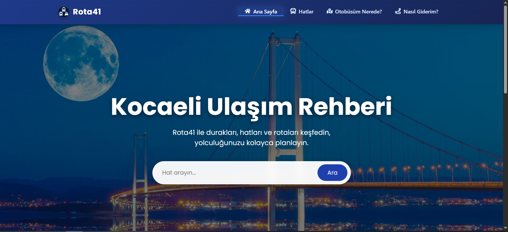
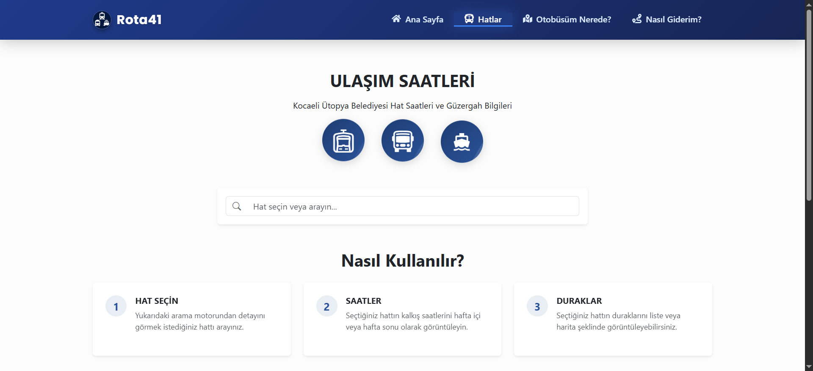
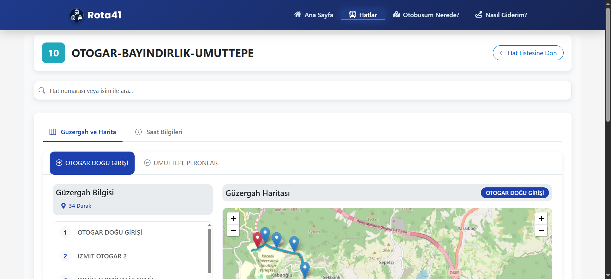
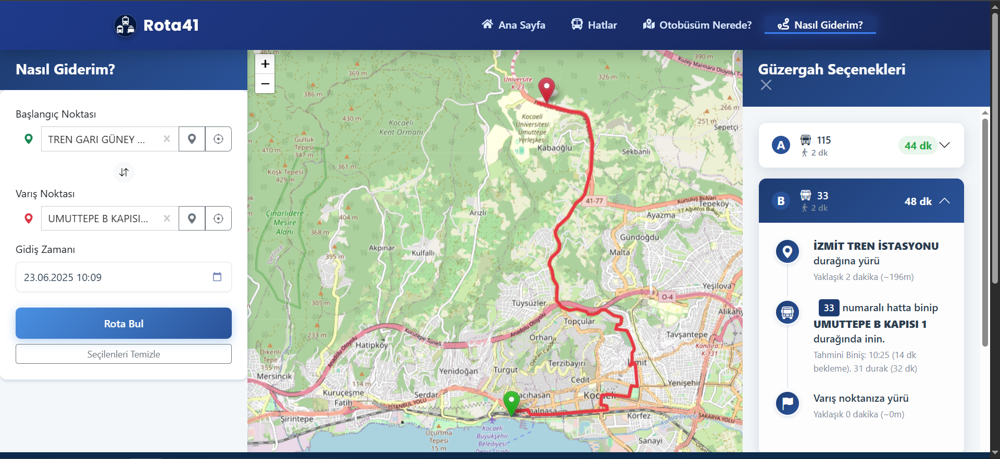
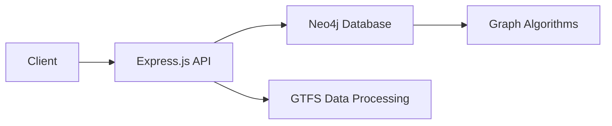
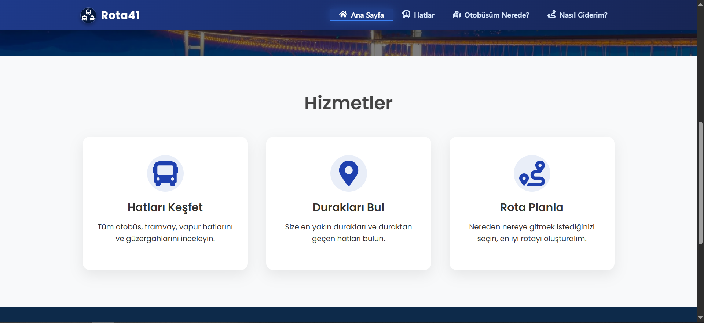
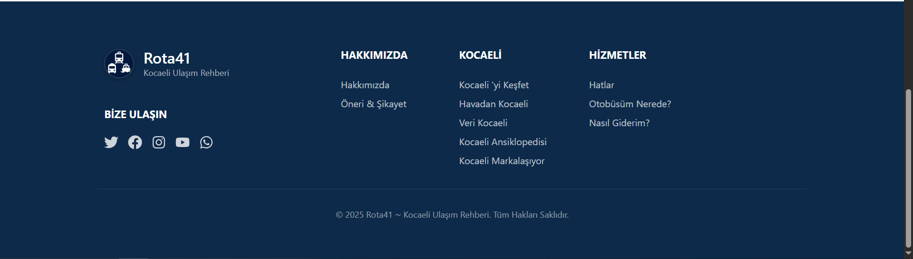

# 🚌 Kocaeli Ulaşım Sistemi

<div align="center">
  
  
  **Neo4j Graf Veritabanı ile Akıllı Şehir İçi Ulaşım Çözümü**
  
  *Kocaeli şehrinin toplu ulaşım ağını dijitalleştiren, kullanıcı dostu ve akıllı rota planlama sistemi*

  [](https://reactjs.org/)
  [](https://nodejs.org/)
  [](https://neo4j.com/)
  [](https://getbootstrap.com/)
</div>

---

## 📱 Uygulama Görselleri

### 🏠 Ana Sayfa
<div align="center">
  
  <p><em>Modern ve kullanıcı dostu ana sayfa tasarımı</em></p>
</div>

### 🚌 Hat Bilgileri
<div align="center">
  
  <p><em>Tüm otobüs hatlarının detaylı listesi</em></p>
</div>

### 🚏 Hat Detayları
<div align="center">
  
  <p><em>Seçilen hattın durakları ve güzergah bilgileri</em></p>
</div>

### 🗺️ Rota Planlama
<div align="center">
  
  <p><em>"Nasıl Giderim?" özelliği ile akıllı rota planlama</em></p>
</div>

---

## ✨ Temel Özellikler

### 🎯 **Akıllı Rota Planlama**
- Graf algoritmaları ile en kısa ve en hızlı rotaları hesaplama
- Aktarma noktalarını otomatik belirleme
- Alternatif güzergah önerileri

### 🚌 **Kapsamlı Hat Yönetimi**
- Tüm otobüs hatlarının detaylı bilgileri
- Durak bazında saat bilgileri
- Güzergah haritaları ve görselleştirme

### 🚏 **Durak Bilgileri**
- Her duraktan geçen hatların listesi
- Durak konumu ve çevre bilgileri
- Gerçek zamanlı varış saatleri

### 📍 **Harita Entegrasyonu**
- Leaflet ile interaktif harita deneyimi
- Durak ve güzergah görselleştirme
- Mobil uyumlu harita kontrolleri

---

## 🔧 Teknoloji Altyapısı

<div align="center">

### Backend Architecture


</div>

### 🖥️ **Backend Technologies**
| Teknoloji | Versiyon | Açıklama |
|-----------|----------|----------|
| **Node.js** | Latest | Server-side JavaScript runtime |
| **Express.js** | 4.18.2 | Web application framework |
| **Neo4j** | 5.12.0 | Graf veritabanı sistemi |
| **GTFS Parser** | Custom | Toplu taşıma veri işleme |

### 🎨 **Frontend Technologies**
| Teknoloji | Versiyon | Açıklama |
|-----------|----------|----------|
| **React** | 19.1.0 | Modern UI framework |
| **Bootstrap** | 5.3.6 | Responsive CSS framework |
| **Leaflet** | 1.9.4 | Interactive map library |
| **React Router** | 7.6.2 | Client-side routing |
| **SASS** | 1.89.2 | CSS preprocessing |

---

## 🚀 Hızlı Başlangıç

### 📋 **Sistem Gereksinimleri**
```bash
✅ Node.js (v16.0+)
✅ Neo4j Database (v4.0+)
✅ Python 3.8+ (veri yükleme için)
✅ npm veya yarn
```

### ⚡ **Kurulum Adımları**

#### 1️⃣ **Repository'yi Klonlayın**
```bash
git clone https://github.com/baranguzelgul/rota41.git
cd rota41
```

#### 2️⃣ **Backend Kurulumu**
```bash
# Bağımlılıkları yükleyin
npm install

# Neo4j bağlantısını yapılandırın
# src/configs/neo4j.js dosyasını düzenleyin
```

#### 3️⃣ **Frontend Kurulumu**
```bash
cd client
npm install
```

#### 4️⃣ **Veri Tabanını Hazırlayın**
```bash
# GTFS verilerini Neo4j'ye yükleyin
python veri_yukle.py
```

#### 5️⃣ **Uygulamayı Başlatın**

**Backend Server:**
```bash
# Ana dizinde
npm run dev  # Geliştirme modu
# veya
npm start    # Production modu
```

**Frontend:**
```bash
# Client klasöründe
cd client
npm start
```

#### 🌐 **Erişim Adresleri**
- **Frontend:** `http://localhost:3000`
- **Backend API:** `http://localhost:3001`
- **Neo4j Browser:** `http://localhost:7474`

---

## 🏗️ Proje Mimarisi

<div align="center">
  
  <p><em>Kullanıcı arayüzü ve sistem entegrasyonu</em></p>
</div>

### 📁 **Klasör Yapısı**
```
kocaeli_ulasim/
├── 📂 client/                    # React Frontend
│   ├── 📂 public/               # Statik dosyalar
│   ├── 📂 src/
│   │   ├── 📂 components/       # React bileşenleri
│   │   │   ├── 🚏 duraklar/     # Durak yönetimi
│   │   │   ├── 🚌 hatlar/       # Hat yönetimi  
│   │   │   ├── 🗺️ nasilgiderim/ # Rota planlama
│   │   │   └── 🏠 Home.js       # Ana sayfa
│   │   └── 📂 services/         # API servisleri
├── 📂 src/                      # Node.js Backend
│   ├── 📂 configs/              # Veritabanı ayarları
│   ├── 📂 controllers/          # API kontrolcüleri
│   ├── 📂 routes/               # REST endpoints
│   ├── 📂 services/             # İş mantığı
│   └── 📂 utils/                # Yardımcı fonksiyonlar
├── 📂 veri/                     # GTFS veri dosyaları
├── 📂 screenshots/              # Uygulama görselleri
└── 🐍 veri_yukle.py            # Veri yükleme scripti
```

---

## 📄 Lisans

Bu proje [MIT Lisansı](LICENSE) altında lisanslanmıştır. Detaylar için LICENSE dosyasına bakabilirsiniz.

---

<div align="center">
  
  
  **⭐ Projeyi beğendiyseniz yıldız vermeyi unutmayın!**
  
</div>